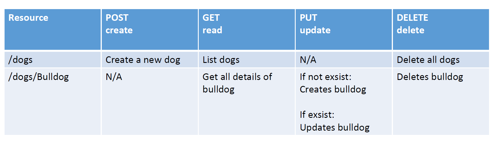

# API design

Torsdag den 17:e januari 2019

## Lektionsplan
Lektion från kl. 8:30 till kl. 16:00

1. Uppsummering av senaste lektion
2. Genomgång av dagens ämne (API design)
3. ~~Quiz~~
4. Genomgång av övning till idag.
5. 11:30 Projekt 1 avslutning
6. 13:00 Projekt 2 start

## Kurslitteratur

**Pull request**:
* [The Art of Humanizing Pull Requests](https://blog.rangle.io/the-art-of-humanizing-pull-requests-prs/)

**OpenAPI och Swager**:
* [Intro to Swagger – A Structured Approach to Creating an API](https://spin.atomicobject.com/2018/08/30/swagger-api-intro/)

**API design**:
* [An Introduction to APIs For the Uninitiated](https://nordicapis.com/an-introduction-to-apis-for-the-uninitiated/)
* [Understanding  the API-First Approach to Building Products](https://swagger.io/resources/articles/adopting-an-api-first-approach/)
* [Three Principles of API First Design](https://medium.com/adobetech/three-principles-of-api-first-design-fa6666d9f694)

## Extra kurslitteratur

Detta är inspiration till material man kan läsa för att öka chansen för VG.

* [Key Lessons From 100 API Projects](https://nordicapis.com/key-lessons-from-100-api-projects/)

**OpenAPI / Swagger**:

* [OpenAPI Specification](https://swagger.io/specification/)
* [Basic Structure](https://swagger.io/docs/specification/basic-structure/)
* [Adding Examples](https://swagger.io/docs/specification/adding-examples/)

**Api first**:
* [The Three Principles of Excellent API Design](https://nordicapis.com/the-three-principles-of-excellent-api-design/)
* [Understanding API First Design](https://www.programmableweb.com/api-university/understanding-api-first-design)

**API design**:

* Gratis e-bok: [Web API Design - Crafting Interfaces that Developers Love](https://pages.apigee.com/rs/apigee/images/api-design-ebook-2012-03.pdf)

## Övningar
I tabellen under ses ett REST API till att tillgå hundraser, beskriv detta API med OpenApi i systemet [SwaggerHub](https://swagger.io/tools/swaggerhub/), du kommer att behöva en konto, du kommer även att skulle använda detta verktyg i projekt 2.

[Getting Started With SwaggerHub](https://app.swaggerhub.com/help/tutorials/getting-started?_ga=2.255724616.1908547225.1547211400-1552449099.1546671493)

När du är klar med APIet i SwaggerHub, är det möjligt få ett API endpoint (en url), testa detta endpoint med med programmet Postman.

## Projekt
Avslutning projekt 1 med Pull Request

Start projekt 2
Länk till Github classroom to be anounced