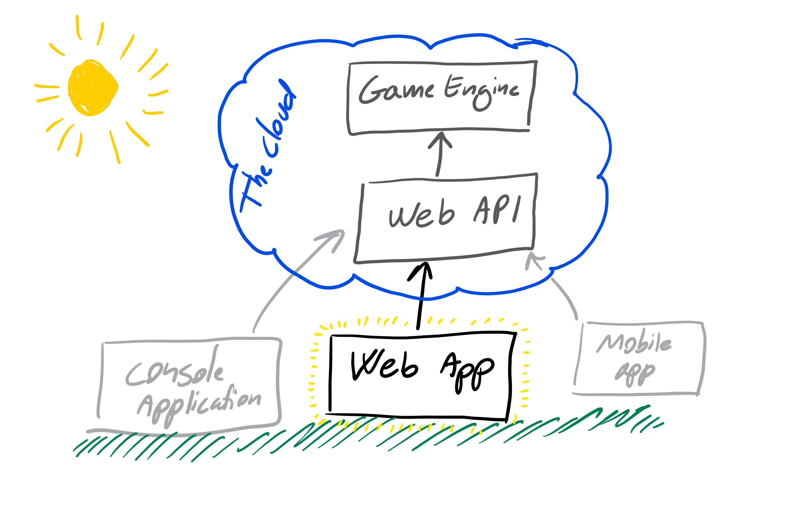
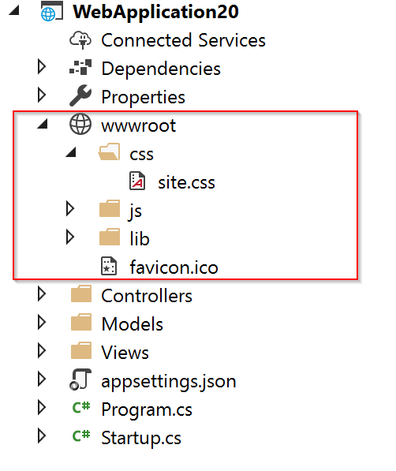

# Fia webbapplikation

## Introduktion till projektet

I [projekt 1](project1.md) har ni utvecklat en spelmotor (GameEngine) som håller håller koll på alla regler i ett fia spel.

I [projekt 2](project2.md) har använt denna spelmotor till att bygg ett Web API, datta API gör det möjligt att starta ett fia spel och för flera spelere att delta i spelet, även möjligt att ha igång flera samtidiga spel, på servern.



Målet i detta projekt är att bygga ett grafisk Fia spel som en webbapplikation och att denna webbapplikation ska använda vårt Fia WebAPI till att hålla koll på all logik.

I den webbapplikation som vi ska bygga är planen att vi ska använda så många av dom teknikker som vi har lärt under kursensgång. 

## Grundtanken 
Det ska vara möjligt att spela spelet för mellan två och fyra spelare, sittande på varje sin dator.

Det ska bara möjligt att starta fler samtidiga spel, på servern, och komma åt ett spel med en given länk.

Där är ingen krav på säkkerhet (finns dock med i VG).

# Krav till projektet

Allt ni gör skall göras i ert GitHub repo (båda kod och dokumentation), som ligger på ert Team. Ni skall använda en ["commit tidigt och ofta"](https://blog.codinghorror.com/check-in-early-check-in-often/) ([1](https://sethrobertson.github.io/GitBestPractices/)) strategi, såklart bör ni endast commita kod som kan kompileras.
Ert repositiory ska vara konfigurerat så att det enda sätt att få in kod i master branchen är via pull requests (detta göras av underviseren), detta betyder att ni inte kan jobba direkt i master men får skåpa en ny branch som ni jobber i ett rekomenderat namn är: *Development*

Ni kan sen göra så många branches baseret på Development som ni önsker, och göra pull requests internt i teamen till *Development*-branchen. Men när projektet är slut är det innehållet av master som räcknas, så ni behöver att göra minst ett pull request från Devleopment till master under projektet med reviewers från ett annat team.

## Dokumentation

Se till att skriv och uppdatera eran [user stories](https://www.mountaingoatsoftware.com/agile/user-stories) (i docs mappen), så att dom passer med eran Web App. Om ni använder någon externa källor (båda kod och annat) ange dom i dokumentationen.

Evt dokumentation kan skrivas med markdown (.md) eller ett annat format som ni känner er bekväma med (.txt, ~~.docx~~, .html, ~~.pdf~~ etc) (helt ett format i rå text), ni väljer själv om ni vill skriva på svenska eller engelska, enda krav är att filerna placeras i */docs* mappen. Vissa delar kan vara svåra att beskriva med text och till dissa kan man med fördel för med bilder, bilder läggs också i docs-mappen och använder ni markdown kan ni länka till dom.

```markdown

```

Gör också ett dokument (använder manual) som beskriver hur man spelar ert spel.

## Programmering
I detta projekt ska ni implementera en Web App till ert Fia spel (Ludo på engelska). Spelet ska vara en ASP.NET Core Web Application (Model-View-Controller).

Kod ska ligga i mappen **src**, varje team får enbart ha **en kodbas**. Där finns i detta repository en *gitignore*-fil som passer till Visual Studio, i **src**-mappen finns även en tom solution, denna kan ni använda till att lägga till ert projekt.

Det rekomeneras att ni kopiere in ert Web Api och eran game engine i eran **src**-mapp.

Ni kan välja att ha WebApp, WebApi och GameEngine i eran solution, detta kan vara smidigt om ni ska behöva att debugga eller inte vill vara beroedende av ett API som kör live av nogon anledning. Men ursprungstanken är att ni håller WebAPI och WebApp som två sperate saker. Så att eran solution enbart kommer att innehålla en WebApp som anroper ett API som äntligen körs lokalt eller på en server. 

Önsker ni inte att använda eran eget API, kan ni här hitta ett väldigt basic ludo game API: [skjohansen/LudoGameApi](https://github.com/skjohansen/LudoGameApi)


## Bygg och deploy

Målet är att eran applikation ska kunna byggas och delpoyas en webbserver. Det enklaste är att göra en publish till en Azure Website i Visual Studio. Men bäst skulle det vara om ni kan lyckas att få till Continious Deployment med AzureDevops.

# Hints
Börja med i teamen med att göra en förväntningsavstämning, vad är erat mål i team, och vad är er individuella styrkor.

Försök att undvika att någon i teamen är syssellösa, om där är samarbetsvanskligheter se till att ta i dom så tidigt som möjligt.

Om någon i gruppen har svårt vid delar av koden, försök att köra pair-programming, och se till at den om tycker det är svårt är [Driver](https://gist.github.com/jordanpoulton/607a8854673d9f22c696)

Om ni sitter på distans träffas med video en gång per dag (via [skype](https://www.skype.com), [google hangout](https://hangouts.google.com), [appear](https://appear.in) eller likande), och kör pair-programming via [TeamViewer](https://www.teamviewer.com) eller likande.

Använd Github aktivt: Issues, Pull requets, Projects. Det gör det enklare för alla hänga med på alla förändringar och idéer.

Försöka att följa SOLID principerna så långt det går.

## Kom igång
1. Beskriv med user stories vad ni förvänter att en använder ska kunna i ert fia spel
    *. Eventuelt: Beskriv för varje user storie ett eller fler scenarios, med [Gherkin](https://docs.cucumber.io/gherkin/reference/) , dissa kommer att vara till stor hjälp som dokumentation när ni ska implementera funktionalitet i spelet. 
1. Skåpa en ASP.NET Core Web Application (Model-View-Controller)
1. Lägg till en ny tom (empty) controller, kall den "LudoController"
1. Skåpa en mapp under View, som hettar samma som din controller: "Ludo"
1. I mappen Ludo, lägg till ett View som hetter samma som en action i din LudoController, där bode finnas in Index-action som standard. Lägg till *index.cshtml* i Ludo-mappen
1. I Index viewen lägg eventuellt till HTML och css som är i för ett fia spel i *examples/LudoBoardHtmlAndCss*
1. I controlern lägg in anrop mot ett Ludo api, i actions som mot svara det som du gärna vill göra
1. Testa att starta applikationen

## Anrop APIet från en annan applikation

Exempel på hur du kan använda och testa ett REST Web API med en konsol applikation (eller annat C# kod)
Nuget paket: [RESTSharp](https://www.nuget.org/packages/RestSharp/) ([Projekt på Github](https://github.com/restsharp/RestSharp))

```csharp
// Retrive the name of a specific Ludo game using the REST API
var client = new RestClient("http://someserver.com/api");

var request = new RestRequest("ludo/{id}", Method.GET);
request.AddUrlSegment("id", "123"); // replaces matching token in request.Resource
RestResponse<LudoGame> ludoGameResponse = client.Execute<LudoGame>(request);
var gameName = ludoGameResponse.Data.GameName;

```

Kolla evt denna artikel med olika tillgångar till hur man kan kommunicera med ett REST API: [A Few Great Ways to Consume RESTful API in C#](https://code-maze.com/different-ways-consume-restful-api-csharp/)

## Statiska ressource
I ASP.NET MVC ska statiska ressourser som CSS läggas i wwwroot mappen:



Och ressourserna som ligger där kommer man åt via HTML:
```html
<link rel="stylesheet" href="~/css/site.css" />
```

# Betygsättning
Detta projekt är betygsgrundande, och startas tisdag den 29:e januari 2019.

Det är dokumentation och kod som är commitat master-branchen innan torsdag den 21:e februari 2019 kl 10:00 som räcknas.

## Branching och pull request
Ni kan göra så många branches baseret på *master* som ni önsker. När projektet är slut är det innehållet av master på **GitHub** som räcknas, så ni behöver att göra minst ett pull request eller merge från eran branch(s) till *master* under projektet med reviewers från ett annat team.

## Krav för G
* Spellogiken styres av ett WebAPI, det rekomderas att använda ert eget API som ni byggd i projekt 2
* En enkelt grafisk repräsentation av spilbräddan
* Spelet måste deployas till en webserver (länk till webserver lägga i docs/link.md)
* Input ska vära valideret
* Logging av som händer i spelet måste implementeras (här är det en fördel om man använder ett eget API, så att man kan få med logging för även den del)
* Minst 3 enhetstestar av delar som innehåller logik (controllers)

## Förslag till VG (G krav + minst 3 VG förslag)
* Inlogning, som är inplementerat med ASP.NET core [authentication och autherization](lecture20190214.md)
* Continious deployment till ett Azure Website (Azure DevOps rekomenderas till CI och CD), beskriving av hur detta är konfigureret läggs i /docs mappen, gärna med screenshots
* Möjlighet att bjuda in/utmana flera spelere via epost, använn en tjänst som [SendGrid](https://sendgrid.com) tiill detta
* Specflow tester
* Spelets pjäserna på spelet ska uppdateras automatisk via [SignalR](lecture20190207.md)
* Stöd för fler språk/kultur (eg. Svenska och engelska), baseret på vad som är konfigureret i webläseren eller vid login
* Alternativ gränssnitt mot API som t.ex. konsol eller app 
* **MORE TO COME: kom med förslag**

